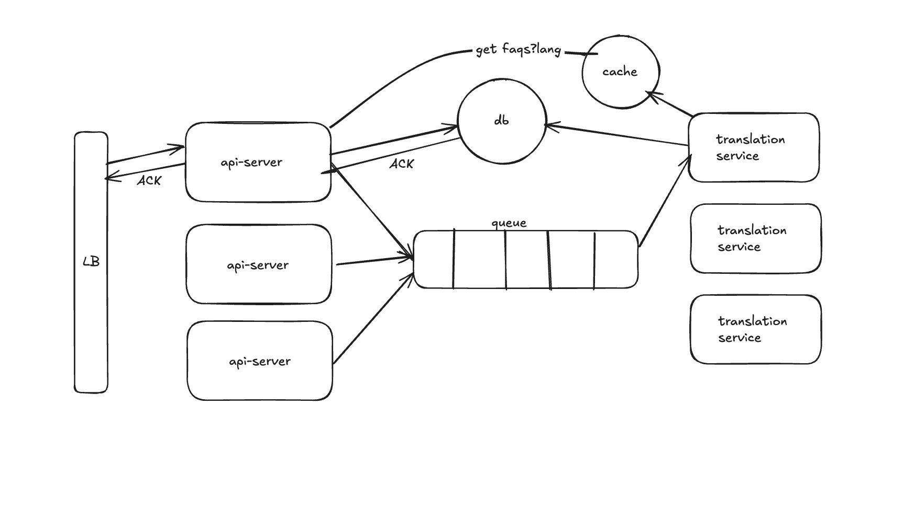

# FAQ Management API

A robust REST API service for managing Frequently Asked Questions (FAQ) with multi-language support, authentication, and caching capabilities.

## Features

### Core Features

- 🌐 **Multilingual Support**

  - FAQ content available in multiple languages (English, Hindi, Bengali)
  - Language-specific content delivery based on user preferences
  - Automatic fallback to default language

- 🔄 **Automatic Translation**

  - Integration with Google Translate API
  - Automatic translation of FAQ content during creation
  - Support for multiple language pairs

- ⚡ **Performance Optimization**

  - Redis caching implementation for faster response times
  - Cached responses for frequently accessed FAQs
  - Automatic cache invalidation on content updates

- 🔒 **Security & Authentication**
  - JWT-based authentication system
  - Role-based access control (Admin/User)
  - Secure refresh token rotation
  - Protected admin routes

### Technical Features

- 🛠 **Backend Technology**

  - Built with Node.js and TypeScript
  - Express.js framework for robust API development
  - MongoDB for flexible document storage
  - Redis for caching and session management

- 📡 **API Architecture**

  - RESTful API design
  - Error handling middleware

## Table of Contents

1. [API Usage](#api-usage)
2. [Installation](#installation)
3. [Contributing Guidelines](#contributing-guidelines)
4. [Features](#features)

## API Usage

### Authentication Endpoints

- `POST /api/v1/admin/register` - Register new admin
- `POST /api/v1/admin/login` - Admin login
- `POST /api/v1/admin/refresh-token` - Refresh access token
- `POST /api/v1/admin/logout` - Logout admin

### FAQ Endpoints

- `GET /api/v1/faq` - Get all FAQs
- `GET /api/v1/faq/:id` - Get FAQ by ID
- `POST /api/v1/faq` - Create new FAQ (Admin only)
- `PUT /api/v1/faq/:id` - Update FAQ (Admin only)
- `DELETE /api/v1/faq/:id` - Delete FAQ (Admin only)

## Installation

### Method 1: Traditional Setup

1. Clone the repository

   ```bash
   git clone <repository-url>
   cd api-server
   ```

2. Install dependencies

   ```bash
   npm install
   ```

3. Configure environment variables
   Create a `.env` file with the following variables:

   ```env
   PORT=3000
   MONGODB_URI=<your-mongodb-uri>
   REDIS_URL=redis://redis:6379
   ACCESS_TOKEN_SECRET=<your-access-token-secret>
   REFRESH_TOKEN_SECRET=<your-refresh-token-secret>
   ACCESS_TOKEN_EXPIRES_IN=15m
   REFRESH_TOKEN_EXPIRES_IN=7d
   NODE_ENV=development
   ```

4. Start the server
   ```bash
   npm run start
   ```

### Method 2: Docker Setup

Simply run:

```bash
docker-compose up --build
```

This will set up both the API server and Redis cache in containers.

## Contributing Guidelines

We welcome contributions! Please follow these steps:

1. Fork the repository
2. Create a new branch
3. Make your changes and commit them
4. Push to your fork
5. Create a pull request

## System Design

### Previous Architecture Challenges

The initial monolithic architecture faced several limitations:

1. **Synchronous Translation**: FAQ creation was slow due to waiting for translations
2. **Resource Intensive**: Translation operations blocked the main API server
3. **Poor Scalability**: Difficult to scale translation services independently
4. **Single Point of Failure**: Server overload during heavy translation requests

### Improved Microservice Architecture

We addressed these challenges with a distributed microservice architecture:

#### Components

1. **API Server**
   - Handles client requests
   - Manages authentication
   - Stores base FAQ content
   - Queues translation requests
2. **Redis Queue**
   - Acts as message broker
   - Ensures reliable message delivery
   - Handles backpressure
3. **Translation Service**
   - Listens to Redis queue
   - Processes translations asynchronously
   - Supports multiple language pairs
   - Updates database with translations

#### Flow

1. Client sends FAQ creation request to API server
2. API server:
   - Validates request
   - Stores base content
   - Sends acknowledgment to client
   - Queues translation job
3. Translation service:
   - Picks jobs from queue
   - Translates content
   - Updates database
   - Refreshes cache

#### Benefits

- ⚡ **Improved Performance**: Async translation doesn't block API responses
- 📈 **Better Scalability**: Services can scale independently
- 💪 **Increased Reliability**: Fault isolation between services
- 🔄 **Queue-Based Resilience**: No data loss during service downtime

[System Architecture Diagram]

